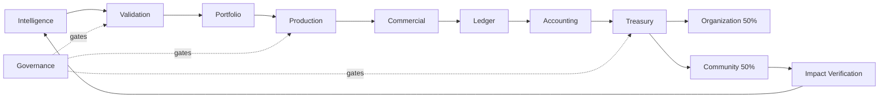

# Architecture

## Principles
Auto Goods Inc is evidence-bound, policy-governed, independently operable, and auditable. State changes use explicit gates. Authority is scoped and never inferred from role. Financial functions are isolated from probabilistic reasoning.

## Components
| Area | Components | Responsibility |
|---|---|---|
| Intelligence | Market Radar, Gap Clusterer, Evidence Engine, Venture Oracle, Competitor Analyst, Distribution Analyst, Economics Analyst | Produce provenance-backed commercial theses |
| Validation | Experiment Designer, Validation Operator, Evidence Judge | Design, run, and independently grade bounded tests |
| Production | Product Architect, Builder, QA Agent, Release Agent | Specify, implement, verify, release |
| Commercial | Positioning, Growth, Pricing, Support, Retention Agents | Operate within approved claims, channels, prices, budgets |
| Executive | Portfolio Controller | Own queue, allocate validation budgets, promote, hold, kill |
| Finance | Accounting Engine, Treasury Controller, Profit Router | Reconcile, calculate, freeze, route deterministically |
| Community | Community Scout, Org Verifier, Need Analyst, Impact Allocator, Impact Verifier | Verify recipients, allocate, independently verify output |
| Governance | Policy evaluation, authority registry, audit log, incident freeze | Enforce boundaries and preserve change history |

## Separation
A hypothesis author cannot grade its success. Portfolio cannot control treasury invariants. Accounting and routing are not LLM judgments. Impact Allocator cannot be Impact Verifier. Marketing cannot write accounting or authorize payouts. Ventures own products, not treasury or governance.

Material decisions produce `PolicyDecision` records and attempts produce `RunReceipt` records. Evidence and provenance travel with records.

## Data boundaries
Public data may include aggregated provenance, distribution totals, recipient/program attribution, and verified outcomes. Internal data includes scores, experiments, and decisions. Restricted data includes credentials, customer transactions, personal and banking data, raw webhook payloads, and incident details. Public lineage may show `Product -> revenue cohort -> DistributionPeriod -> CommunityAllocation -> CommunityOrganization -> CommunityProgram -> ImpactReceipt`, never private customer transactions.

Next.js, Vercel, Convex, Clerk, Stripe, Tailwind, Resend, and appropriate reasoning/classification models are defaults, not constitutional requirements. Fail closed when evidence, authority, identity, reconciliation, or policy is missing.
