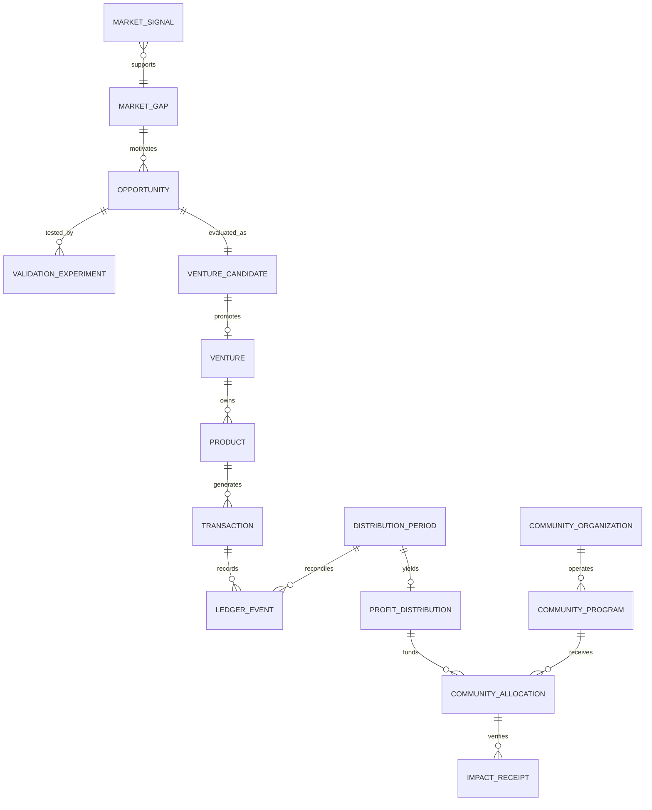

# Domain Model

| Entity | Canonical meaning |
|---|---|
| `MarketSignal` | One observed indication of friction or demand, with provenance |
| `MarketGap` | Repeated unmet or poorly served transition supported by multiple independent signals |
| `Opportunity` | Evidence-backed commercial thesis identifying buyer, alternative, solution, and distribution |
| `ValidationExperiment` | Bounded test with budget, threshold, failure conditions, evidence, and independent judgment |
| `VentureCandidate` | `Opportunity` under resource evaluation |
| `Venture` | Promoted commercial entity allowed to build and operate |
| `Product` | Concrete digital good owned by a `Venture` |
| `Customer` | Buyer or user represented under minimization and privacy rules |
| `Transaction` | Commercial event linked privately to payment provenance |
| `LedgerEvent` | Immutable integer-minor-unit accounting fact or compensating correction |
| `DistributionPeriod` | Closed reconciled accounting interval |
| `ProfitDistribution` | Deterministic organization/community split of eligible profit |
| `CommunityOrganization` | Verified recipient with identity, legal, bank, capacity, program, and reporting evidence |
| `CommunityProgram` | Eligible program in an allowed wellness domain |
| `CommunityAllocation` | Approved community funds assigned to an eligible program |
| `ImpactReceipt` | Independently verified expected and actual allocation output |
| `Evidence` | Labeled claim, provenance, observed inputs where applicable, and collection time |
| `PolicyDecision` | Versioned allow, deny, hold, freeze, or confirmation result |
| `AuthorityGrant` | Scoped bounded delegation that cannot override higher prohibitions |
| `RunReceipt` | Auditable record of an attempted or completed action |

Durable records have stable identifiers, timestamps, and provenance. Financial amounts include currency and integer minor units. State changes require a `PolicyDecision`; requesting authority never bypasses the gate. Attempts emit `RunReceipt` records.
